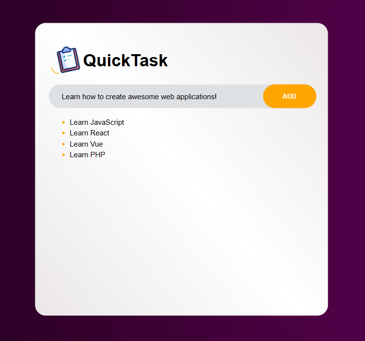
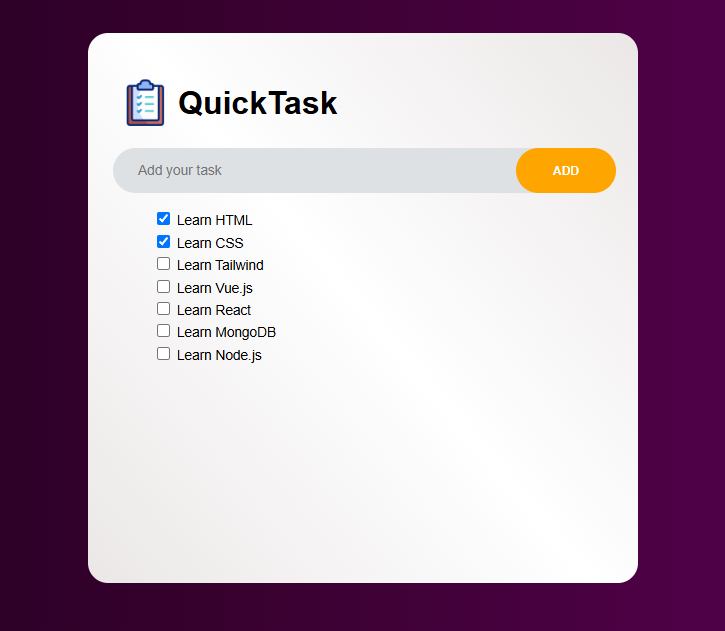

# QuickTask

I’m diving into JavaScript and Vue.js, starting with a simple but powerful project: a Todo List app. This project will help me practice my JavaScript basics (like working with arrays, functions, and handling events), while also gaining hands-on experience with Vue.js to build a dynamic, interactive app.

Through this project, I’ll learn to use Vue’s reactive features and components, while strengthening my understanding of JavaScript. It’s a perfect way to put what I’m learning into practice!

## To-Do

1. Add `styling` to the task items
2. Add the `most recent` added task to the top of the body section
3. Add interactive buttons to the task items (i.e., complete and delete)
4. Add `time/calendar` functionality
5. Add `reminder` functionality
6. Add `completion` tracking
7. Add `category` management
    1. Include `icons` foreach category
    2. Add `option` to include icons when naming category
8. Add `search` functionality
9. Add `sound` foreach task item checked and removed
    1. Include `option` to turn off sound
10. Add `Web Storage API` to save tasks
11. Add `drag and drop` functionality to move tasks around
12. Change body `background-color`
13. Add `Responsive Web Design`

This web app was created with HTML, SCSS, JavaScript and Vue.js

## Examples and Updates

Version 0.1 - **10/12/2024:**

Version 0.1.1 - **11/12/2024:**

