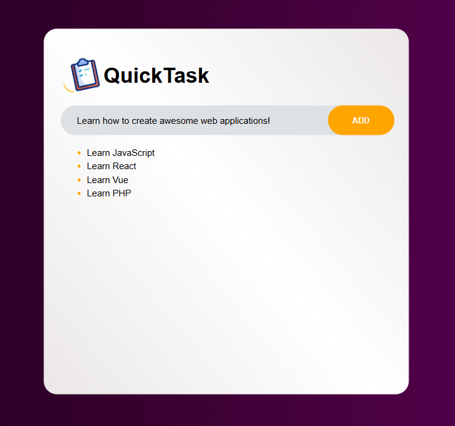

# QuickTask

## To-Do

1. Create `style` for the task items
    - Add accomplishment feature
2. Add `check button` to task items
3. Add `delete button` to task items
4. Make page `responsive`
5. Add `time` functionality to task items
6. Change body `background-color`

This app was created with HTML, SCSS, JS and Vue.js

## Examples and Updates

Version 0.1 - **10/12/2024:**

